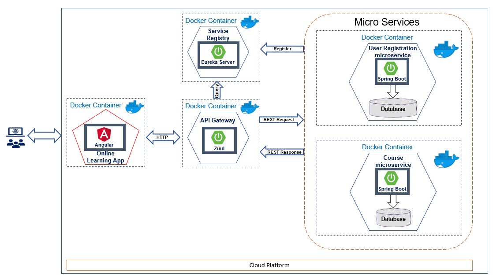

# Cloud Native Application Framework on Docker

This Code can be leveraged to demonstrate 

1) cloud native design patterns (CQRS, Service Discovery, Database per Service, Load balancing, API Gateway, Container based deployment)
  
2) Cloud Native Application Platform developed on Spring Boot Micro services and containerized using Docker.

# Instructions to Setup and Run this Repository.

## Instructions to Run Locally from IDE(Spring Tool Suite) on your laptop or dev environment:

Import this repository as gradle project onto your Favourite IDE like Spring Tool Suite and run each app as Spring Boot App.

Run Angular App as below from Command prompt or Windows Power Shell:

application-framework-docker\user-frontend> npm install

application-framework-docker\user-frontend> ng serve

## Instructions to Run Locally on your laptop or dev environment using Docker:
1) Create Docker Account, download and Install Docker for windows if you want to run these application on Windows
    https://docs.docker.com/docker-for-windows/install/
    
2) Open Windows Powershell or Command Prompt or Terminal.

    Navigate to :\application-framework-docker> docker-compose up --build

    This will build all the applications and deploy them to seperate docker containers
    
    Access the Angular Front End Application at http://localhost:4200/
    
    Access the User Service H2 database at http://localhost:8080/user-service/h2-console/
    
    Access the Course Service H2 database at http://localhost:8080/course-service/h2-console/
    
    Access Eureka at http://localhost:8761/
    
    You can also access Backend Micro services(User Service and Course Service) directly from any REST client via API Gateway URLs.
    For eg., To Access all Courses from any REST Client using API Gateway URL : GET http://localhost:8080/course-service/courses
